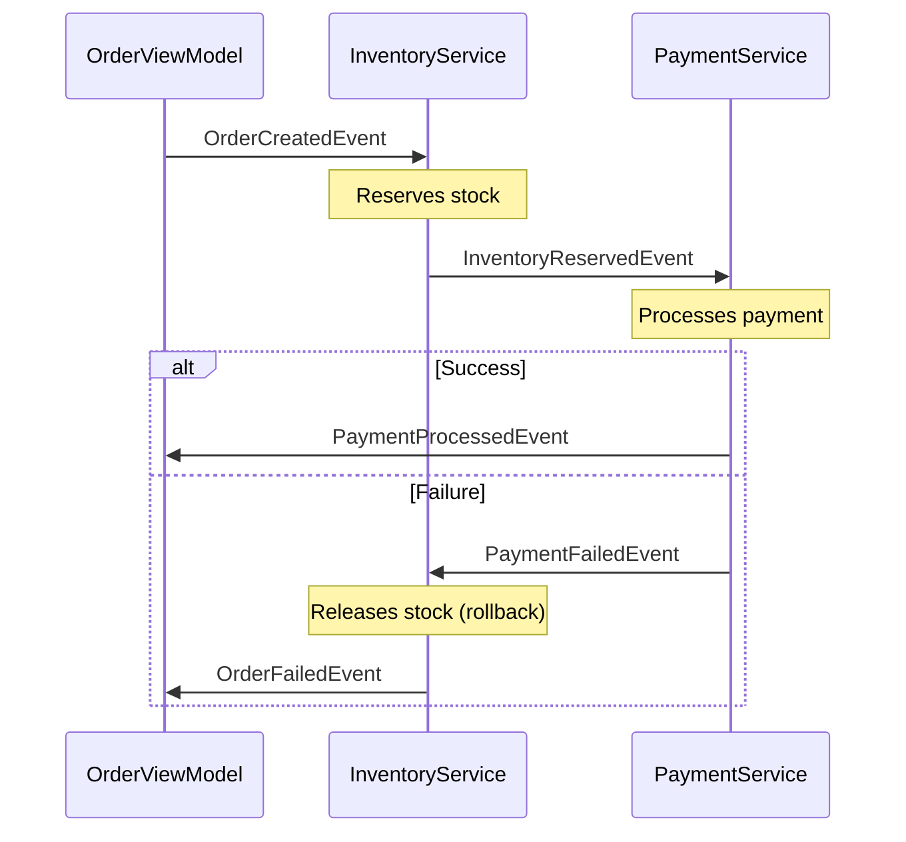
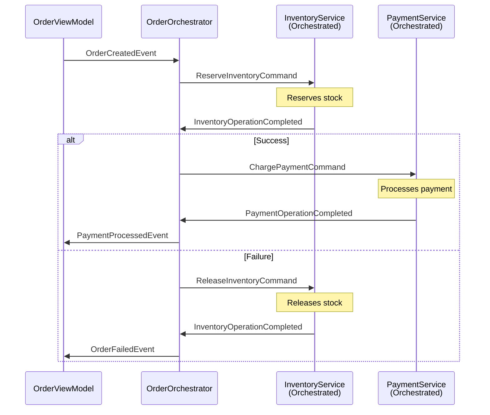

# 🎓 Saga Pattern: Choreography vs Orchestration - Complete Comparison Guide

> **Purpose**: Learn the differences between two saga implementation approaches  
> **Project**: WPF Prism EventAggregator Demo with both implementations  
> **Difficulty**: Beginner to Intermediate

---

## 📋 Table of Contents

1. [Quick Summary](#quick-summary)
2. [What is Choreography?](#what-is-choreography)
3. [What is Orchestration?](#what-is-orchestration)
4. [Side-by-Side Comparison](#side-by-side-comparison)
5. [Code Comparison](#code-comparison)
6. [When to Use Which?](#when-to-use-which)
7. [Pros and Cons](#pros-and-cons)
8. [Visual Flow Diagrams](#visual-flow-diagrams)
9. [Testing Both Approaches](#testing-both-approaches)

---

## Quick Summary

| Aspect | Choreography | Orchestration |
|--------|-------------|---------------|
| **Control** | Decentralized (each service decides) | Centralized (orchestrator decides) |
| **Coupling** | Services know about each other | Services only know orchestrator |
| **Complexity** | Simple for few steps | Better for complex workflows |
| **Visibility** | Hard to see full flow | Easy to monitor entire saga |
| **Maintenance** | Can get messy with many services | Easier to modify workflow |
| **Performance** | Slightly faster (one less hop) | Minimal overhead |
| **Demo Files** | `InventoryService.cs`, `PaymentService.cs` | `OrderOrchestrator.cs`, `*Orchestrated.cs` |

---

## What is Choreography?

### Definition
**Choreography-based Saga**: Each service knows what to do next by subscribing to events from other services. There's no central coordinator.

### Analogy
Think of a dance where each dancer knows their moves independently. They watch other dancers and react accordingly.

### How It Works in This Project



### Key Characteristics

1. **No Central Coordinator**: Services communicate directly
2. **Event-Driven**: Uses domain events (`OrderCreatedEvent`, `InventoryReservedEvent`)
3. **Implicit Workflow**: Flow emerges from event subscriptions
4. **Tight Coupling**: Services must know which events to listen for

### Code Example (Current Implementation)

**InventoryService.cs** (Choreography):
```csharp
public InventoryService(IEventAggregator eventAggregator)
{
    // Listens to order creation
    _eventAggregator.GetEvent<OrderCreatedEvent>().Subscribe(OnOrderCreated);
    
    // Listens to payment failure for rollback
    _eventAggregator.GetEvent<PaymentFailedEvent>().Subscribe(OnPaymentFailed);
}

private void OnOrderCreated(OrderCreatedPayload payload)
{
    // Reserve inventory
    Log("Stock RESERVED", "SUCCESS");
    
    // Publish event for NEXT service (PaymentService)
    _eventAggregator.GetEvent<InventoryReservedEvent>().Publish(...);
}

private void OnPaymentFailed(PaymentFailedPayload payload)
{
    // Compensating transaction
    Log("Releasing stock (ROLLBACK)", "ROLLBACK");
}
```

**PaymentService.cs** (Choreography):
```csharp
public PaymentService(IEventAggregator eventAggregator)
{
    // Listens to inventory reservation
    _eventAggregator.GetEvent<InventoryReservedEvent>().Subscribe(OnInventoryReserved);
}

private void OnInventoryReserved(InventoryReservedPayload payload)
{
    if (payment succeeds)
    {
        _eventAggregator.GetEvent<PaymentProcessedEvent>().Publish(...);
    }
    else
    {
        _eventAggregator.GetEvent<PaymentFailedEvent>().Publish(...);
    }
}
```

---

## What is Orchestration?

### Definition
**Orchestration-based Saga**: A central orchestrator controls the workflow by sending commands to services and receiving responses. Services don't know about each other.

### Analogy
Think of an orchestra conductor who tells each musician when to play. Musicians only respond to the conductor, not to each other.

### How It Works in This Project



### Key Characteristics

1. **Central Coordinator**: `OrderOrchestrator` controls everything
2. **Command-Response**: Uses commands (`ReserveInventoryCommand`) and responses
3. **Explicit Workflow**: Flow is clearly defined in orchestrator
4. **Loose Coupling**: Services don't know about each other

### Code Example (New Implementation)

**OrderOrchestrator.cs**:
```csharp
public class OrderOrchestrator
{
    private readonly Dictionary<int, OrderSagaState> _activeSagas;

    public OrderOrchestrator(IEventAggregator eventAggregator)
    {
        // Listen to ALL service responses
        _eventAggregator.GetEvent<OrderCreatedEvent>().Subscribe(OnOrderCreated);
        _eventAggregator.GetEvent<InventoryOperationCompletedEvent>().Subscribe(OnInventoryResponse);
        _eventAggregator.GetEvent<PaymentOperationCompletedEvent>().Subscribe(OnPaymentResponse);
    }

    private void OnOrderCreated(OrderCreatedPayload payload)
    {
        // Create saga state
        var sagaState = new OrderSagaState { OrderId = payload.OrderId };
        _activeSagas[payload.OrderId] = sagaState;
        
        // STEP 1: Tell InventoryService to reserve
        _eventAggregator.GetEvent<ReserveInventoryCommand>().Publish(new ReserveInventoryCommandPayload
        {
            OrderId = payload.OrderId,
            Quantity = 1
        });
    }

    private void OnInventoryResponse(InventoryOperationCompletedEvent payload)
    {
        if (payload.Success)
        {
            // STEP 2: Tell PaymentService to charge
            _eventAggregator.GetEvent<ChargePaymentCommand>().Publish(new ChargePaymentCommandPayload
            {
                OrderId = payload.OrderId,
                Amount = 99.99m
            });
        }
        else
        {
            // Cancel order
            CompleteSagaAsFailed(payload.OrderId, "Inventory reservation failed");
        }
    }

    private void OnPaymentResponse(PaymentOperationCompletedEvent payload)
    {
        if (payload.Success)
        {
            // SUCCESS: Complete saga
            _eventAggregator.GetEvent<PaymentProcessedEvent>().Publish(...);
        }
        else
        {
            // FAILURE: Trigger compensation
            _eventAggregator.GetEvent<ReleaseInventoryCommand>().Publish(new ReleaseInventoryCommandPayload
            {
                OrderId = payload.OrderId
            });
        }
    }
}
```

**InventoryServiceOrchestrated.cs**:
```csharp
public class InventoryServiceOrchestrated
{
    public InventoryServiceOrchestrated(IEventAggregator eventAggregator)
    {
        // Only listens to orchestrator commands, NOT domain events
        _eventAggregator.GetEvent<ReserveInventoryCommand>().Subscribe(OnReserveInventory);
        _eventAggregator.GetEvent<ReleaseInventoryCommand>().Subscribe(OnReleaseInventory);
    }

    private void OnReserveInventory(ReserveInventoryCommandPayload payload)
    {
        // Reserve inventory
        Log("Stock reserved", "SUCCESS");
        
        // Report back to orchestrator ONLY
        _eventAggregator.GetEvent<InventoryOperationCompletedEvent>().Publish(new InventoryOperationCompletedPayload
        {
            OrderId = payload.OrderId,
            Success = true
        });
    }

    private void OnReleaseInventory(ReleaseInventoryCommandPayload payload)
    {
        // Release inventory (compensation)
        Log("Stock released", "ROLLBACK");
        
        // Report back to orchestrator
        _eventAggregator.GetEvent<InventoryOperationCompletedEvent>().Publish(new InventoryOperationCompletedPayload
        {
            OrderId = payload.OrderId,
            Success = true
        });
    }
}
```

---

## Side-by-Side Comparison

### Event Flow Comparison

#### Choreography Flow:
```
User → OrderViewModel → OrderCreatedEvent
                     ↓
              InventoryService (listens to OrderCreatedEvent)
                     ↓
              InventoryService → InventoryReservedEvent
                     ↓
              PaymentService (listens to InventoryReservedEvent)
                     ↓
              PaymentService → PaymentProcessedEvent OR PaymentFailedEvent
                     ↓ (if failed)
              InventoryService (listens to PaymentFailedEvent)
                     ↓
              InventoryService → OrderFailedEvent
```

#### Orchestration Flow:
```
User → OrderViewModel → OrderCreatedEvent
                     ↓
              OrderOrchestrator (central coordinator)
                     ↓
              OrderOrchestrator → ReserveInventoryCommand
                     ↓
              InventoryServiceOrchestrated (only listens to commands)
                     ↓
              InventoryServiceOrchestrated → InventoryOperationCompletedEvent
                     ↓
              OrderOrchestrator → ChargePaymentCommand
                     ↓
              PaymentServiceOrchestrated (only listens to commands)
                     ↓
              PaymentServiceOrchestrated → PaymentOperationCompletedEvent
                     ↓
              OrderOrchestrator → PaymentProcessedEvent OR ReleaseInventoryCommand
                     ↓ (if failed)
              InventoryServiceOrchestrated → Release inventory
                     ↓
              OrderOrchestrator → OrderFailedEvent
```

### Communication Pattern

| Aspect | Choreography | Orchestration |
|--------|-------------|---------------|
| **Message Type** | Domain Events | Commands + Responses |
| **Example** | `OrderCreatedEvent`, `InventoryReservedEvent` | `ReserveInventoryCommand`, `InventoryOperationCompletedEvent` |
| **Direction** | Broadcast (anyone can listen) | Point-to-point (orchestrator ↔ service) |
| **Knowledge** | Service A knows Service B exists | Service only knows orchestrator |

---

## Code Comparison

### Starting the Saga

**Choreography**:
```csharp
// OrderViewModel just publishes event - doesn't know what happens next
_eventAggregator.GetEvent<OrderCreatedEvent>().Publish(new OrderCreatedPayload
{
    OrderId = id,
    OrderName = OrderName
});
// InventoryService automatically reacts (subscribed to this event)
```

**Orchestration**:
```csharp
// OrderViewModel publishes same event
_eventAggregator.GetEvent<OrderCreatedEvent>().Publish(new OrderCreatedPayload
{
    OrderId = id,
    OrderName = OrderName
});
// OrderOrchestrator receives it and EXPLICITLY tells InventoryService what to do
```

### Handling a Step

**Choreography** (InventoryService):
```csharp
// Automatically reacts to OrderCreatedEvent
private void OnOrderCreated(OrderCreatedPayload payload)
{
    ReserveStock();
    
    // Publishes event for PaymentService to hear
    _eventAggregator.GetEvent<InventoryReservedEvent>().Publish(...);
}
```

**Orchestration** (InventoryServiceOrchestrated):
```csharp
// Only responds to explicit command from orchestrator
private void OnReserveInventory(ReserveInventoryCommandPayload payload)
{
    ReserveStock();
    
    // Reports back to orchestrator ONLY
    _eventAggregator.GetEvent<InventoryOperationCompletedEvent>().Publish(...);
}
```

### Error Handling

**Choreography**:
```csharp
// PaymentService decides to trigger rollback
if (paymentFails)
{
    // Publishes failure event
    _eventAggregator.GetEvent<PaymentFailedEvent>().Publish(...);
    // InventoryService hears this and rolls back
}
```

**Orchestration**:
```csharp
// PaymentServiceOrchestrated just reports result
if (paymentFails)
{
    _eventAggregator.GetEvent<PaymentOperationCompletedEvent>().Publish(new PaymentOperationCompletedPayload
    {
        Success = false,
        ErrorMessage = "Payment declined"
    });
    // OrderOrchestrator receives this and DECIDES to trigger rollback
}
```

---

## When to Use Which?

### Use Choreography When:

✅ **Simple workflows** (2-4 steps)  
✅ **Maximum loose coupling** needed  
✅ Services are **truly independent**  
✅ **Performance critical** (avoid extra hop through orchestrator)  
✅ **Few conditional branches**  
✅ Team prefers **event-driven architecture**  

**Example Scenarios:**
- Simple order processing (inventory → payment)
- Notification workflows (email → SMS → push)
- Data synchronization between systems

### Use Orchestration When:

✅ **Complex workflows** (5+ steps)  
✅ Need **centralized monitoring/logging**  
✅ **Conditional branching** (if amount > $1000, require approval)  
✅ Easier **debugging and testing** required  
✅ Want to **add/remove steps** without changing services  
✅ Need **saga state tracking**  
✅ Business logic should be **centralized**  

**Example Scenarios:**
- Complex order fulfillment (inventory → payment → shipping → notification → analytics)
- Multi-step approval workflows
- Workflows with timeouts and retries
- Systems requiring audit trails

---

## Pros and Cons

### Choreography

#### ✅ Advantages:
1. **Simple to implement** for small workflows
2. **Very loose coupling** - services don't know about each other directly
3. **No single point of failure** - no central coordinator
4. **Easy to add new listeners** - just subscribe to events
5. **Natural fit** for event-driven architectures

#### ❌ Disadvantages:
1. **Hard to understand full workflow** - must trace through multiple services
2. **Tight coupling via events** - services must know which events to listen for
3. **Risk of cyclic dependencies** - Service A → B → A
4. **Difficult debugging** - hard to see where saga is in process
5. **Complex error handling** - each service handles its own errors
6. **No centralized state** - hard to track saga progress

### Orchestration

#### ✅ Advantages:
1. **Clear workflow visibility** - entire flow in one place
2. **Easy to modify** - change orchestrator without touching services
3. **Centralized error handling** - orchestrator manages failures
4. **Better testability** - can test orchestrator logic independently
5. **Saga state tracking** - easy to see current step
6. **Conditional logic** - easy to add branches (if/else)
7. **No cyclic dependencies** - services only talk to orchestrator

#### ❌ Disadvantages:
1. **Single point of failure** - if orchestrator fails, saga stops
2. **Slightly more complex** - extra layer of indirection
3. **Minimal performance overhead** - one extra hop per message
4. **Orchestrator can become bloated** - if too much logic is centralized
5. **Services less reusable** - tied to specific orchestrator commands

---

## Visual Flow Diagrams

### Choreography: Distributed Control

```
┌──────────────┐
│   User/UI    │
└──────┬───────┘
       │ Place Order
       ▼
┌──────────────┐
│ OrderViewModel│ ─── publishes ──→ OrderCreatedEvent
└──────────────┘                        │
                                        │ (listens)
                                        ▼
                               ┌────────────────┐
                               │InventoryService│
                               └───────┬────────┘
                                       │ reserves stock
                                       │
                                       │ ─── publishes ──→ InventoryReservedEvent
                                       │                        │
                                       │                        │ (listens)
                                       │                        ▼
                                       │               ┌────────────────┐
                                       │               │PaymentService  │
                                       │               └───────┬────────┘
                                       │                       │
                                       │                  processes payment
                                       │                       │
                                       │                       │
                              ┌────────┴────────┐              │
                              │                 │              │
                     (listens)│           success│         failure│ (listens)
                              ▼                 ▼              ▼
                     ┌────────────────┐  ┌──────────┐  ┌──────────────┐
                     │InventoryService│  │Payment   │  │Payment       │
                     │ releases stock │  │Processed │  │Failed Event  │
                     └────────────────┘  └──────────┘  └──────────────┘
```

### Orchestration: Centralized Control

```
┌──────────────┐
│   User/UI    │
└──────┬───────┘
       │ Place Order
       ▼
┌──────────────┐
│ OrderViewModel│ ─── publishes ──→ OrderCreatedEvent
└──────────────┘                        │
                                        │ (listens)
                                        ▼
                               ┌─────────────────┐
                               │OrderOrchestrator│ ← CENTRAL COORDINATOR
                               └───────┬─────────┘
                                       │
                    ┌──────────────────┼──────────────────┐
                    │                  │                   │
                    │ command          │ command           │ response
                    ▼                  ▼                   │
          ┌────────────────┐  ┌────────────────┐          │
          │InventoryService│  │PaymentService  │          │
          │   Orchestrated │  │   Orchestrated │          │
          └───────┬────────┘  └───────┬────────┘          │
                  │                   │                   │
                  │ response          │ response          │
                  └───────────────────┴───────────────────┘
                                      │
                                      │ orchestrator decides next step
                                      │
                    ┌─────────────────┼─────────────────┐
                    │ success         │                 │ failure
                    ▼                 │                 ▼
          ┌────────────────┐         │       ┌─────────────────┐
          │PaymentProcessed│         │       │ReleaseInventory │
          │    Event       │         │       │   Command       │
          └────────────────┘         │       └────────┬────────┘
                                     │                │
                                     │                ▼
                                     │       ┌────────────────┐
                                     │       │InventoryService│
                                     │       │   releases     │
                                     │       └────────┬───────┘
                                     │                │
                                     │                ▼
                                     │       ┌────────────────┐
                                     │       │ OrderFailed    │
                                     │       │    Event       │
                                     └────────┴────────────────┘
```

---

## Testing Both Approaches

### How to Switch Between Implementations

The project includes **BOTH** implementations. You can switch between them by modifying `App.xaml.cs`:

#### To Use Choreography (Default):
```csharp
protected override void RegisterTypes(IContainerRegistry containerRegistry)
{
    // Register choreography services
    containerRegistry.RegisterSingleton<InventoryService>();
    containerRegistry.RegisterSingleton<PaymentService>();
    
    // Comment out orchestration services
    // containerRegistry.RegisterSingleton<OrderOrchestrator>();
    // containerRegistry.RegisterSingleton<InventoryServiceOrchestrated>();
    // containerRegistry.RegisterSingleton<PaymentServiceOrchestrated>();
}

protected override void OnInitialized()
{
    base.OnInitialized();
    
    Container.Resolve<InventoryService>();
    Container.Resolve<PaymentService>();
    
    // Container.Resolve<OrderOrchestrator>();
    // Container.Resolve<InventoryServiceOrchestrated>();
    // Container.Resolve<PaymentServiceOrchestrated>();
}
```

#### To Use Orchestration:
```csharp
protected override void RegisterTypes(IContainerRegistry containerRegistry)
{
    // Comment out choreography services
    // containerRegistry.RegisterSingleton<InventoryService>();
    // containerRegistry.RegisterSingleton<PaymentService>();
    
    // Register orchestration services
    containerRegistry.RegisterSingleton<OrderOrchestrator>();
    containerRegistry.RegisterSingleton<InventoryServiceOrchestrated>();
    containerRegistry.RegisterSingleton<PaymentServiceOrchestrated>();
}

protected override void OnInitialized()
{
    base.OnInitialized();
    
    // Container.Resolve<InventoryService>();
    // Container.Resolve<PaymentService>();
    
    Container.Resolve<OrderOrchestrator>();
    Container.Resolve<InventoryServiceOrchestrated>();
    Container.Resolve<PaymentServiceOrchestrated>();
}
```

### Observing the Differences

When you run the application:

**Choreography Logs:**
```
ℹ️ [OrderViewModel] Order 1 placed by user
ℹ️ [InventoryService] Order 1: Received. Attempting to reserve stock...
✅ [InventoryService] Order 1: Stock successfully RESERVED
ℹ️ [PaymentService] Order 1: Received reservation. Processing payment...
✅ [PaymentService] Order 1: Payment charged successfully
```

**Orchestration Logs:**
```
ℹ️ [ORCHESTRATOR] Order 1: Received. Starting orchestrated saga...
ℹ️ [ORCHESTRATOR] Order 1: Step 1 - Sending RESERVE command to InventoryService
ℹ️ [ORCHESTRATED] Order 1: Received RESERVE command
ℹ️ [ORCHESTRATED] Order 1: Reserving 1 item(s)...
✅ [ORCHESTRATED] Order 1: Stock reserved successfully
ℹ️ [ORCHESTRATOR] Order 1: Received inventory response: SUCCESS
ℹ️ [ORCHESTRATOR] Order 1: Step 2 - Sending CHARGE command to PaymentService
ℹ️ [ORCHESTRATED] Order 1: Received CHARGE command for 99.99 USD
✅ [ORCHESTRATED] Order 1: Payment SUCCESSFUL
ℹ️ [ORCHESTRATOR] Order 1: Received payment response: SUCCESS
✅ [ORCHESTRATOR] Order 1: ✅ SUCCESS - All steps completed!
```

Notice how orchestration logs show `[ORCHESTRATOR]` making decisions at each step!

---

## Interview Questions & Answers

### Q1: What's the main difference between choreography and orchestration?

**Answer:**
> "In choreography, each service knows what to do next by listening to events from other services - there's no central coordinator. In orchestration, a central orchestrator controls the workflow by sending commands to services and deciding next steps based on responses."

---

### Q2: When would you choose choreography over orchestration?

**Answer:**
> "I'd choose choreography for simple workflows with 2-4 steps where services are truly independent and maximum loose coupling is needed. It's simpler to implement and has slightly better performance since there's no central coordinator bottleneck."

---

### Q3: What are the risks of choreography?

**Answer:**
> "The main risks are:
> 1. **Cyclic dependencies** - Service A triggers B which triggers A
> 2. **Hard to debug** - difficult to trace workflow across multiple services
> 3. **Tight coupling via events** - services must know which events to subscribe to
> 4. **No centralized state** - hard to track saga progress or implement timeouts"

---

### Q4: How does orchestration help with testing?

**Answer:**
> "With orchestration, I can:
> 1. Test the orchestrator logic independently by mocking services
> 2. Test each service in isolation by mocking the orchestrator
> 3. Simulate different failure scenarios easily in the orchestrator
> 4. Verify the entire workflow by checking orchestrator state
> 
> In choreography, testing requires setting up multiple services and their event subscriptions."

---

### Q5: Can you mix both patterns?

**Answer:**
> "Yes! A common approach is to use orchestration for the main workflow but choreography for side effects. For example:
> - Main order flow uses orchestrator (inventory → payment → shipping)
> - Notification system uses choreography (listens to OrderCompletedEvent to send email)
> 
> This gives you centralized control for critical paths while keeping non-critical features loosely coupled."

---

## Summary Table

| Feature | Choreography | Orchestration |
|---------|-------------|---------------|
| **Control** | Distributed | Centralized |
| **Complexity** | Low (simple flows) | Medium (complex flows) |
| **Coupling** | Via events | Via orchestrator |
| **Visibility** | Low | High |
| **Testability** | Moderate | High |
| **Extensibility** | Add listeners | Modify orchestrator |
| **Performance** | Slightly better | Minimal overhead |
| **Best For** | 2-4 steps, simple logic | 5+ steps, complex logic |

---

## Key Takeaways

1. **Choreography** = Dance where each dancer knows their moves
2. **Orchestration** = Conductor directing musicians
3. **Start with choreography** for simple workflows
4. **Switch to orchestration** when workflow becomes complex
5. **Both patterns** support compensating transactions for rollback
6. **This project** demonstrates both - try switching between them!

---

**Next Steps:**
1. Run the application with choreography (default)
2. Observe the logs
3. Switch to orchestration in App.xaml.cs
4. Compare the logs and behavior
5. Try adding a new step (e.g., ShippingService) to both approaches
6. Decide which pattern fits your use case better!

---

*Remember: There's no "better" pattern - only the right pattern for your specific scenario. Understanding both makes you a better architect!*
